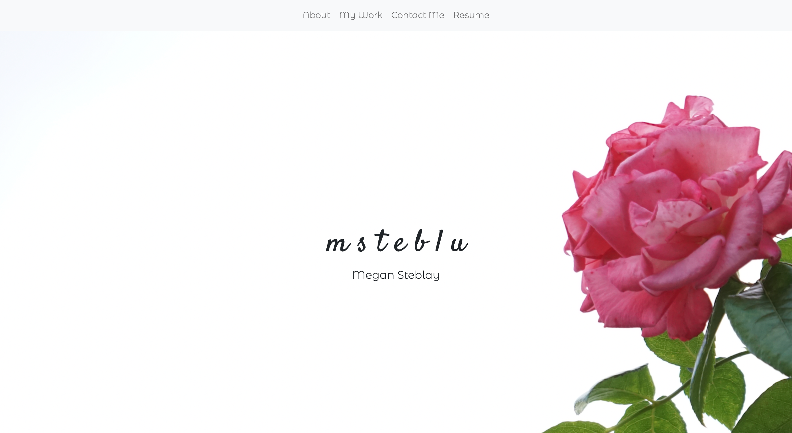

# My Updated Portfolio

## Description

Built from the ground up, this web-page was built in order to showcase my work as a web developer in an online portfolio. Using HTML and CSS, as well as the CSS framework Bootstrap, I built a responsive site that displays some of my coding projects. 

## Installation

The portfolio has been deployed to a GitHub Pages site ([here](https://msteblu.github.io/Portfolio/)).

Its components (HTML and CSS files) are also accessible through a download and clone. 

## Usage

Navigate either to the deployed GitHub ([site](https://msteblu.github.io/Portfolio/)) or open the index.html file in your browser. Once there, you can access information about me, my contact information, and details on some of my work. 

## License

Licensed under the [MIT](https://github.com/microsoft/vscode/blob/main/LICENSE.txt) license. 